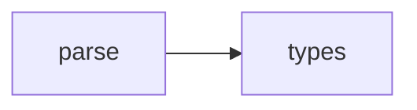

## When to Read
- editing or refactoring `parse.ts`

## Overview
- `src/graph-builder/plan/parse.ts` (19 lines · 1 top-level symbols) — Mirror — `src/graph-builder/plan/parse.ts`

## Graph


## Signatures

```typescript
// ── src/graph-builder/plan/parse.ts ──
export function parseBuildPlan(raw: string): BuildPlan | null { /* ~16 lines */ }

```

## Dependencies
**Internal:**
- `src/graph-builder/types`
