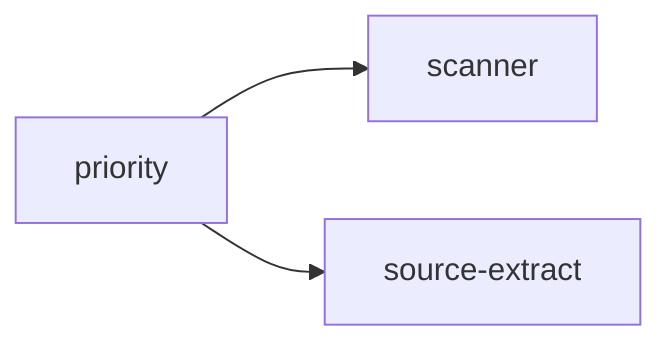

## When to Read
- editing or refactoring `priority.ts`

## Overview
- `src/graph-builder/plan/priority.ts` (150 lines · 4 top-level symbols) — Mirror — `src/graph-builder/plan/priority.ts`

## Graph


## Signatures

```typescript
// ── src/graph-builder/plan/priority.ts ──
export type InstructionPriority = 'P0' | 'P1' | 'P2';
/** Higher urgency wins (P0 > P1 > P2). */
export function maxPriority(a: InstructionPriority, b: InstructionPriority): InstructionPriority { return RANK[a] <= RANK[b] ? a : b; }
/**
 * Heuristic priority for a single source file (deterministic / metadata).
 * Aligns with planning prompt: P0 entry & critical paths, P1 frequent, P2 leaf/rare.
 */
export function inferFilePriority( relPath: string, opts?: { /* ~102 lines */ }
/** Subsystem priority = most urgent file in the chunk (mirror bundle or folder group). */
export function inferSubsystemPriority(sourceFiles: string[], scan?: ScanResult): InstructionPriority { /* ~28 lines */ }

```

## Dependencies
**Internal:**
- `src/scanner`
- `src/source-extract`
