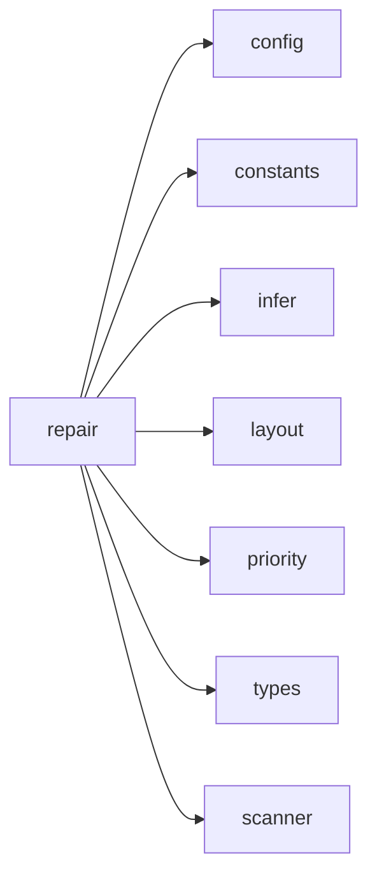

## When to Read
- editing or refactoring `repair.ts`

## Overview
- `src/graph-builder/plan/repair.ts` (262 lines · 7 top-level symbols) — Source-code paths the scanner read that merit their own instruction files.

## Graph


## Signatures

```typescript
// ── src/graph-builder/plan/repair.ts ──
export function shouldExcludeFromSubsystems(relPath: string): boolean { const name = path.posix.basename(relPath); return INSTRUCTION_EXCLUDE_RE.some(r => r.test(name) || r.test(relPath)); }
/** Source-code paths the scanner read that merit their own instruction files. */
export function collectScannedSourcePaths(scan: ScanResult): string[] { return scan.files .filter(f => f.tier !== 3 && f.content.length > 0 && !shouldExcludeFromSubsystems(f.path)) .map(f => f.path) .sort(); }
/**
 * After LLM plan + gap-fill, merge subsystems whose source files all live
 * under the same canonical directory into a single instruction file.
 */
export function applyCanonicalGroupings(plan: BuildPlan, repairOpts?: RepairBuildPlanOptions): BuildPlan { /* ~36 lines */ }
export function dedupeSubsystemSourceFiles(plan: BuildPlan): BuildPlan { const seen = new Set<string>(); const subsystems: BuildPlanItem[] = []; for (const s of plan.subsystems) { const sourceFiles = s.sourceFiles.filter(p => { if (seen.…
export function groupPathsIntoAutoSubsystems( paths: string[], scan: ScanResult, usedInstructionRelPaths: Set<string>, repairOpts?: RepairBuildPlanOptions ): BuildPlanItem[] { /* prompt template (~98 lines) */ }
/** Maps `Config` subsystem layout fields into `repairBuildPlan` options. */
export function repairBuildPlan( scan: ScanResult, rawPlan: BuildPlan | null, repairOpts?: RepairBuildPlanOptions ): BuildPlan { /* ~54 lines */ }
/** Maps `Config` subsystem layout fields into `repairBuildPlan` options. */
export function repairOptionsFromConfig(config: Config): RepairBuildPlanOptions { return { subsystemGrouping: config.subsystemGrouping, maxFilesPerFolderSubsystem: config.maxFilesPerFolderSubsystem, subsystemLayout: config.subsystemLayou…

```

## Dependencies
**Internal:**
- `src/config`
- `src/graph-builder/constants`
- `src/graph-builder/plan/infer`
- `src/graph-builder/plan/layout`
- `src/graph-builder/plan/priority`
- `src/graph-builder/types`
- `src/scanner`
