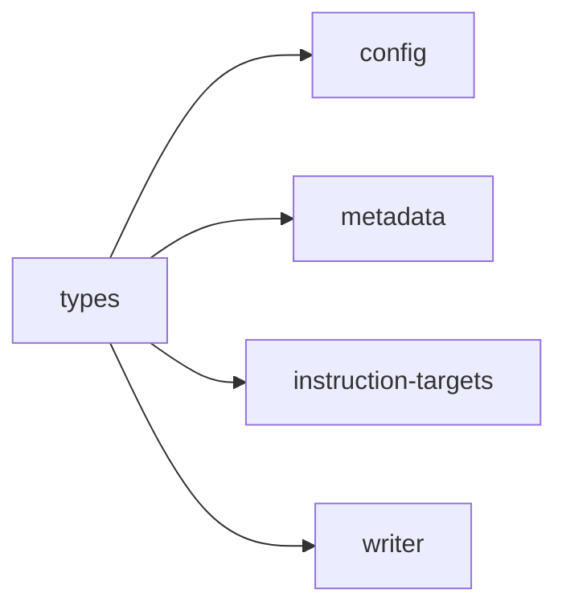

## When to Read
- editing or refactoring `types.ts`

## Overview
- `src/graph-builder/types.ts` (91 lines · 10 top-level symbols) — Mirror — `src/graph-builder/types.ts`

## Graph


## Signatures

```typescript
// ── src/graph-builder/types.ts ──
export type BuildMode = 'BUILD' | 'ACTUALIZE' | 'REVIEW' | 'IMPACT';
export interface BuildOptions { changedFiles?: string[]; targetFile?: string; existingGraphDir?: string; }
export interface GraphResult { files: OutputFile[]; rawResponse: string; usage: LLMUsage; costUSD: number | null; }
export interface MultiPassResult { files: OutputFile[]; usage: LLMUsage; costUSD: number | null; passes: number; /** Always present after Pass 0: parsed plan merged with scan coverage (no missing source files). */ plan: BuildPlan; }
/** Options for `repairBuildPlan` gap-fill / deterministic subsystem layout. */
export interface RepairBuildPlanOptions { subsystemGrouping?: SubsystemGrouping; maxFilesPerFolderSubsystem?: number; /** `mirror` (default): paths under `.github/instructions/` mirror the repo. `canonical`: legacy core/infra. */ subsyst…
export interface DeterministicBuildOptions { /* ~14 lines */ }
export interface BuildPlanItem { /** Relative path inside .github/instructions/, e.g. "core/scanner.instructions.md" */ file: string; area: string; priority: 'P0' | 'P1' | 'P2'; sourceFiles: string[]; /** Glob for frontmatter applyTo, e.…
export interface BuildPlan { projectName: string; projectDescription: string; techStack: string[]; buildCommand?: string; testCommand?: string; subsystems: BuildPlanItem[]; }
export interface BuildCallbacks { onPlanReady?: (plan: BuildPlan) => void; onPassComplete?: (pass: number, totalPasses: number, label: string, files: OutputFile[], cost: number | null) => void; }
export interface HybridBuildOptions { /** * Max number of subsystems to enrich with LLM notes. Remaining subsystems are deterministic-only. * Keep this small for local models and fast runs. */ maxSubsystems?: number; /** "subsystem" = on…

```

## Dependencies
**Internal:**
- `src/config`
- `src/graph-builder/deterministic/metadata`
- `src/instruction-targets`
- `src/providers/types`
- `src/writer`
