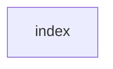

## When to Read
- editing or refactoring `index.ts`

## Overview
- `src/index.ts` (56 lines · 16 exports) — Programmatic API — for embedding context-graph in other tools

## Graph


## Signatures

```typescript
// ── src/index.ts ──
export { loadConfig, initConfig, initConfigInteractive, getModelMaxTokens, MODEL_MAX_OUTPUT_TOKENS, providerAllowsMissingApiKey, } from './config'
export type { Config, ContextDepth, SubsystemGrouping, SubsystemLayout } from './config'
export { scanProject, formatForLLM, classifyFile, scanForPromptDepth, GRAPH_CONTEXT_IGNORE_FILENAMES } from './scanner'
export type { ScannedFile, ScanResult } from './scanner'
export { resolveProjectRoot, tryGitRepositoryRoot } from './project-root'
export { buildGraph, buildGraphMultiPass, buildGraphDeterministic, estimateCost, parseBuildPlan, repairBuildPlan, repairOptionsFromConfig, } from './graph-builder'
export type { BuildMode, BuildOptions, GraphResult, MultiPassResult, BuildPlan, BuildPlanItem, BuildCallbacks, RepairBuildPlanOptions, DeterministicBuildOptions, HybridBuildOptions, } from './graph-builder'
export { parseOutputFiles, writeOutputFiles } from './writer'
export type { OutputFile, WriteResult } from './writer'
export { installPrePushHook, saveLastBuildRef, getChangedFilesSinceLastBuild, filterSignificantFiles, } from './hooks'
export { createProvider } from './providers'
export type { LLMProvider, LLMMessage, LLMUsage, LLMResponse, ProviderConfig } from './providers'
export { matchAgents, fetchAgents, writeAgents } from './agents'
export type { FetchedAgent, AgentsWriteResult } from './agents'
export { AGENTS_CATALOG, MAX_RECOMMENDED_AGENTS } from './agents-catalog'
export type { AgentEntry, AgentMatchRule } from './agents-catalog'

```

## Dependencies
- No dependencies detected

## Error Handling
- No explicit throws detected

## Danger Zone 🔴
- No env vars or side effects detected