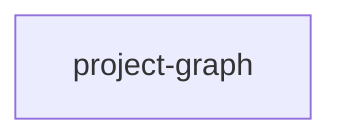

## When to Read
- editing or refactoring `project-graph.ts`

## Overview
- `src/project-graph.ts` (15 lines · 1 top-level symbols) — Mirror — `src/project-graph.ts`

## Graph


## Signatures

```typescript
// ── src/project-graph.ts ──
/** True when a prior context-graph build left core files under `.github/instructions/`. */
export function projectGraphExists(projectRoot: string): boolean { return GRAPH_MARKER_PATHS.some(rel => fs.existsSync(path.join(projectRoot, rel))); }

```

## Dependencies
- No dependencies detected

## Danger Zone 🔴
- **[fs]** filesystem I/O
