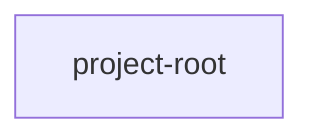

## When to Read
- editing or refactoring `project-root.ts`

## Overview
- `src/project-root.ts` (57 lines · 2 exports) — Git work tree root, or null if `cwd` is not inside a Git repository.

## Graph


## Signatures

```typescript
// ── src/project-root.ts ──
/**
 * Git work tree root, or null if `cwd` is not inside a Git repository.
 */
export function tryGitRepositoryRoot(cwd: string): string | null { try { const out = execFileSync('git', ['rev-parse', '--show-toplevel'], { cwd, encoding: 'utf8', stdio: ['ignore', 'pipe', 'ignore'], }).trim(); if (!out) return null; re…
/**
 * Resolves where `.github/instructions/` and `.context-graph.json` live.
 *
 * - **Implicit cwd** (no CLI `[dir]`, or `dir` is `.` / same as `process.cwd()`):
 *   1. `CONTEXT_GRAPH_ROOT` if set and points to an existing directory
 *   2. else Git repository root from cwd (`git rev-parse --show-toplevel`)
 *   3. else `path.resolve(cwd)`
 * - **Explicit `[dir]`** (subfolder path): that path only — no Git uplift (monorepo package roots).
 */
export function resolveProjectRoot(cliDirArg: string | undefined, cwd: string = process.cwd()): string { const resolvedCwd = path.resolve(cwd); const start = cliDirArg ? path.resolve(cwd, cliDirArg) : resolvedCwd; const resolvedStart = p…

```

## Dependencies
- No dependencies detected

## Error Handling
- No explicit throws detected

## Danger Zone 🔴
- Reads `process.env.CONTEXT_GRAPH_ROOT`