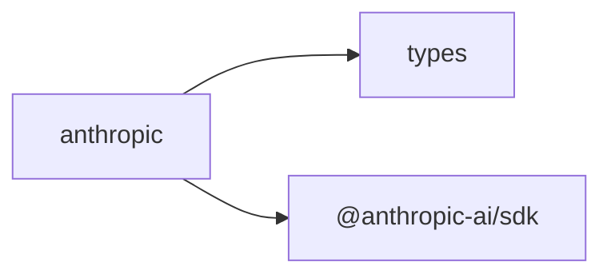

## When to Read
- editing or refactoring `anthropic.ts`

## Overview
- `src/providers/anthropic.ts` (38 lines · 1 top-level symbols) — Mirror — `src/providers/anthropic.ts`

## Graph


## Signatures

```typescript
// ── src/providers/anthropic.ts ──
export class AnthropicProvider implements LLMProvider { /* ~34 lines */ }

```

## Dependencies
**Internal:**
- `src/providers/types`

**External:**
- `@anthropic-ai/sdk`

## Error Handling
- `Error`: "API key not found. Set the ${config.apiKeyEnv} environment variable." (`anthropic.ts`)
