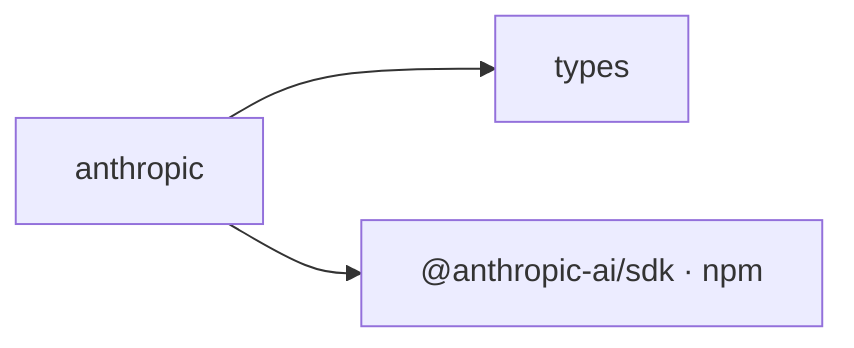

## When to Read
- editing or refactoring `anthropic.ts`

## Overview
- `src/providers/anthropic.ts` (38 lines · 1 exports) — Mirror — `src/providers/anthropic.ts`

## Graph


## Signatures

```typescript
// ── src/providers/anthropic.ts ──
export class AnthropicProvider implements LLMProvider { private client: Anthropic; private model: string; private maxTokens: number; constructor(config: ProviderConfig) { const apiKey = process.env[config.apiKeyEnv]; if (!apiKey) { throw…

```

## Dependencies
**Internal:**
- `src/providers/types`

**External (npm):**
- `@anthropic-ai/sdk`

## Error Handling
- `Error`: "API key not found. Set the ${config.apiKeyEnv} environment variable." (`anthropic.ts`)

## Danger Zone 🔴
- No env vars or side effects detected