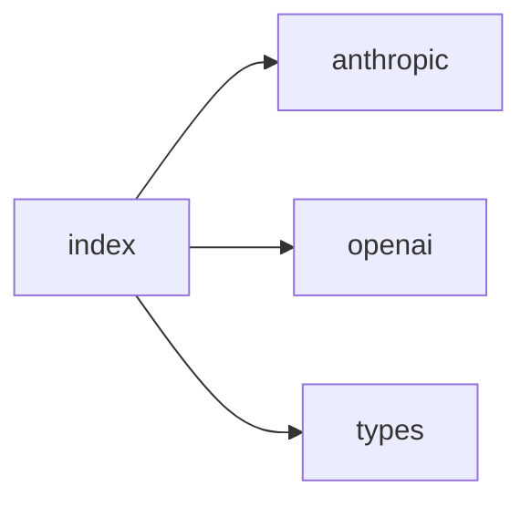

## When to Read
- editing or refactoring `index.ts`

## Overview
- `src/providers/index.ts` (19 lines · 2 top-level symbols) — Mirror — `src/providers/index.ts`

## Graph


## Signatures

```typescript
// ── src/providers/index.ts ──
export function createProvider(config: ProviderConfig): LLMProvider { switch (config.provider) { case 'openai': case 'openai-compat': case 'ollama': return new OpenAIProvider(config); case 'anthropic': return new AnthropicProvider(config…
export type { LLMProvider, LLMMessage, LLMUsage, LLMResponse, ProviderConfig } from './types'

```

## Dependencies
**Internal:**
- `src/providers/anthropic`
- `src/providers/openai`
- `src/providers/types`

## Error Handling
- `Error`: "Unknown provider: ${(config as ProviderConfig).provider}" (`index.ts`)
