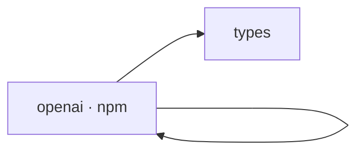

## When to Read
- editing or refactoring `openai.ts`

## Overview
- `src/providers/openai.ts` (48 lines · 1 exports) — Mirror — `src/providers/openai.ts`

## Graph


## Signatures

```typescript
// ── src/providers/openai.ts ──
export class OpenAIProvider implements LLMProvider { private client: OpenAI; private model: string; private maxTokens: number; constructor(config: ProviderConfig) { const isOllama = config.provider === 'ollama'; // Ollama (local) has no …

```

## Dependencies
**Internal:**
- `src/providers/types`

**External (npm):**
- `openai`

## Error Handling
- No explicit throws detected

## Danger Zone 🔴
- No env vars or side effects detected