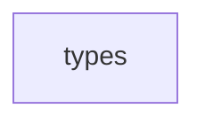

## When to Read
- editing or refactoring `types.ts`

## Overview
- `src/providers/types.ts` (27 lines · 5 exports) — Mirror — `src/providers/types.ts`

## Graph


## Signatures

```typescript
// ── src/providers/types.ts ──
export interface LLMMessage { role: 'user' | 'assistant'; content: string; }
export interface LLMUsage { inputTokens: number; outputTokens: number; }
export interface LLMResponse { content: string; usage: LLMUsage; }
export interface LLMProvider { complete(systemPrompt: string, messages: LLMMessage[]): Promise<LLMResponse>; }
export interface ProviderConfig { provider: 'openai' | 'anthropic' | 'openai-compat' | 'ollama'; model: string; apiKeyEnv: string; baseUrl?: string; maxTokens?: number; }

```

## Dependencies
- No dependencies detected

## Error Handling
- No explicit throws detected

## Danger Zone 🔴
- No env vars or side effects detected