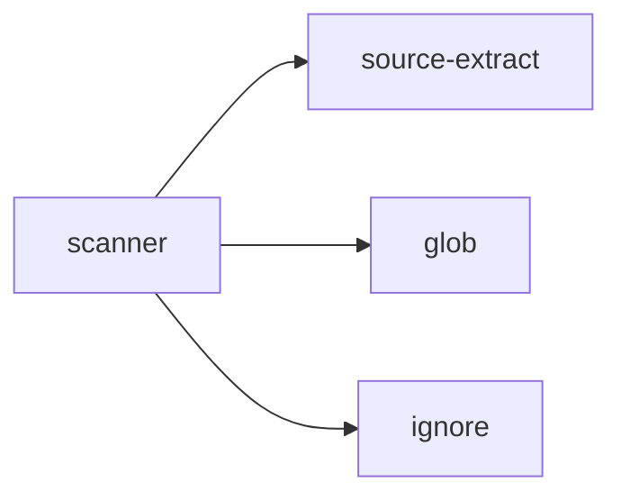

## When to Read
- editing or refactoring `scanner.ts`

## Overview
- `src/scanner.ts` (344 lines · 7 top-level symbols) — Root files with gitignore-style rules, scanned after `.gitignore` / `.copilotignore`.

## Graph


## Signatures

```typescript
// ── src/scanner.ts ──
/** Root files with gitignore-style rules, scanned after `.gitignore` / `.copilotignore`. */
export const GRAPH_CONTEXT_IGNORE_FILENAMES = ['.graph-context-ignore', '.context-graph-ignore'] as const;
export interface ScannedFile { path: string; tier: 0 | 1 | 2 | 3; content: string; lines: number; truncated: boolean; }
export interface ScanResult { tree: string; files: ScannedFile[]; tokenEstimate: number; fileCount: number; skippedCount: number; }
export function classifyFile(relPath: string): 0 | 1 | 2 | 3 { const normalized = relPath.replace(/\\/g, '/'); const parts = normalized.split('/'); const name = parts[parts.length - 1]; if (parts.some(p => TIER3_DIRS.has(p))) return 3; i…
export async function scanProject( projectRoot: string, maxFiles = 200, maxInputTokens = 80000, options?: { /* ~126 lines */ }
export function formatForLLM(scan: ScanResult): string { /* prompt template (~52 lines) */ }
/**
 * Returns a shallow copy of the scan with long file bodies truncated for LLM prompts.
 * Tier 0–2 only; Tier 3 unchanged. Does not replace full scan for `repairBuildPlan` / `buildMetadataJson`.
 */
export function scanForPromptDepth(scan: ScanResult, depth: 'full' | 'slim'): ScanResult { /* ~20 lines */ }

```

## Dependencies
**Internal:**
- `src/source-extract`

**External:**
- `glob`
- `ignore`

## Danger Zone 🔴
- **[fs]** filesystem I/O
