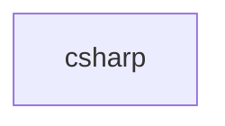

## When to Read
- editing or refactoring `csharp.ts`

## Overview
- `src/source-extract/csharp.ts` (71 lines · 2 top-level symbols) — C# symbol and import extraction.

## Graph


## Signatures

```typescript
// ── src/source-extract/csharp.ts ──
export function extractCSharpSymbolLines(cs: string): string[] { /* ~43 lines */ }
/** `using Foo.Bar;`, `global using`, `using static`. */
export function extractCSharpImports(cs: string): string[] { const out: string[] = []; for (const rawLine of cs.replace(/\r\n/g, '\n').split('\n')) { const t = rawLine.trim(); if (!t || t.startsWith('//')) continue; const m = t.match(/^(…

```

## Dependencies
- No dependencies detected
