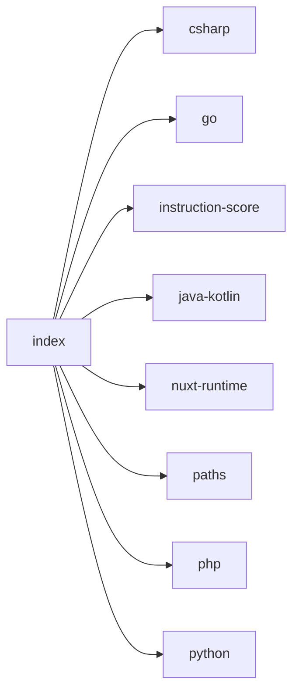

## When to Read
- editing or refactoring `index.ts`

## Overview
- `src/source-extract/index.ts` (40 lines · 13 top-level symbols) — Shared helpers for Vue / PHP / Python / Go — scanner + deterministic graph.

## Graph


## Signatures

```typescript
// ── src/source-extract/index.ts ──
/**
 * Shared helpers for Vue / PHP / Python / Go — scanner + deterministic graph.
 * @module source-extract
 */
export { isMessageOrPromptPath, isExecutableModulePath, isComposableLikePath } from './paths'
export { isPromptTemplateBody, compactTsExportLine } from './ts-prompt'
export { extractScriptSkeleton } from './ts-skeleton'
export { instructionSplitScore, INSTRUCTION_OWN_FILE_SCORE_THRESHOLD, } from './instruction-score'
export { extractVueScriptCombined, scriptOrSelfForAnalysis, extractVuePropKeys, extractVueSymbolLines, extractVueTemplateBrief, buildVueRoutingSignatures, extractVueComputedBranches, } from './vue-sfc'
export { extractNuxtRuntimeBullets, extractDeterministicErrors, extractSideEffectBullets, } from './nuxt-runtime'
export { extractPhpSymbolLines, extractPhpMethodParamNames, extractPhpJsonResponseKeys, buildPhpRoutingSignatures, buildPhpOneLineSummary, extractPhpUseStatements, } from './php'
export { extractPythonSymbolLines, extractPythonImports } from './python'
export { extractGoImports, extractGoSymbolLines } from './go'
export { extractCSharpSymbolLines, extractCSharpImports } from './csharp'
export { extractRustImports, extractRustSymbolLines } from './rust'
export { extractJavaKotlinImports, extractJavaKotlinSymbolLines } from './java-kotlin'
export { extractRubyImports, extractRubySymbolLines } from './ruby'

```

## Dependencies
**Internal:**
- `src/source-extract/csharp`
- `src/source-extract/go`
- `src/source-extract/instruction-score`
- `src/source-extract/java-kotlin`
- `src/source-extract/nuxt-runtime`
- `src/source-extract/paths`
- `src/source-extract/php`
- `src/source-extract/python`
- `src/source-extract/ruby`
- `src/source-extract/rust`
- `src/source-extract/ts-prompt`
- `src/source-extract/ts-skeleton`
- `… +1 more (open repo for full list)`
