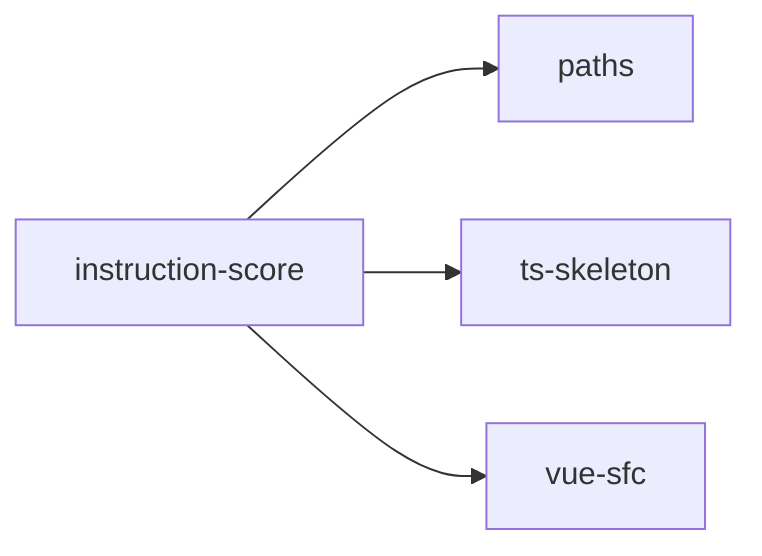

## When to Read
- editing or refactoring `instruction-score.ts`

## Overview
- `src/source-extract/instruction-score.ts` (47 lines · 2 top-level symbols) — Mirror — `src/source-extract/instruction-score.ts`

## Graph


## Signatures

```typescript
// ── src/source-extract/instruction-score.ts ──
/** Score for auto split: one instruction file per “heavy” module (no LLM). */
export function instructionSplitScore(relPath: string, content: string, lines?: number): number { /* ~39 lines */ }
export const INSTRUCTION_OWN_FILE_SCORE_THRESHOLD = 42;

```

## Dependencies
**Internal:**
- `src/source-extract/paths`
- `src/source-extract/ts-skeleton`
- `src/source-extract/vue-sfc`
