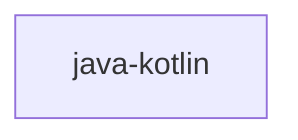

## When to Read
- editing or refactoring `java-kotlin.ts`

## Overview
- `src/source-extract/java-kotlin.ts` (45 lines · 2 top-level symbols) — Java / Kotlin symbol and import extraction.

## Graph


## Signatures

```typescript
// ── src/source-extract/java-kotlin.ts ──
/** Java / Kotlin symbol and import extraction. */
export function extractJavaKotlinImports(src: string): string[] { const out: string[] = []; for (const rawLine of src.replace(/\r\n/g, '\n').split('\n')) { const t = rawLine.trim(); if (!t || t.startsWith('//') || t.startsWith('/*')) con…
export function extractJavaKotlinSymbolLines(src: string): string[] { /* ~29 lines */ }

```

## Dependencies
- No dependencies detected
