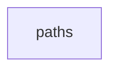

## When to Read
- editing or refactoring `paths.ts`

## Overview
- `src/source-extract/paths.ts` (25 lines · 3 top-level symbols) — Prompt/message modules: prefer bundle + compact instructions (deterministic routing).

## Graph


## Signatures

```typescript
// ── src/source-extract/paths.ts ──
/** Prompt/message modules: prefer bundle + compact instructions (deterministic routing). */
export function isMessageOrPromptPath(relPath: string): boolean { const norm = relPath.replace(/\\/g, '/'); return ( /(?:^|\/)(?:messages|prompts?)\//i.test(norm) || /graph-create-agent/i.test(norm) || /\/(?:prompt|messages)\./i.test(nor…
/** CLI / command registration — collapse as executable, not LLM prompt template. */
export function isExecutableModulePath(relPath: string): boolean { const norm = relPath.replace(/\\/g, '/'); return ( /(?:^|\/)cli(?:\/|\.)/i.test(norm) || /(?:^|\/)commands?\//i.test(norm) || /(?:^|\/)hooks\.ts$/i.test(norm) ); }
/** `dev/composables/foo.ts`, `src/composables/bar.js`, etc. */
export function isComposableLikePath(relPath: string): boolean { return /(?:^|\/)composables\/[^/]+\.(?:[mc]?[jt]sx?|jsx?)$/i.test(relPath.replace(/\\/g, '/')); }

```

## Dependencies
- No dependencies detected
