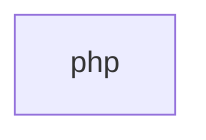

## When to Read
- editing or refactoring `php.ts`

## Overview
- `src/source-extract/php.ts` (198 lines · 6 top-level symbols) — PHP routing and symbol extraction.

## Graph


## Signatures

```typescript
// ── src/source-extract/php.ts ──
/** PHP routing and symbol extraction. */
export function extractPhpSymbolLines(php: string): string[] { /* ~30 lines */ }
/** Balanced `(...)` after `function name` — supports multiline Laravel DI lists. */
export function extractPhpMethodParamNames(php: string, methodName: string): string[] { /* ~29 lines */ }
/** JSON / array keys from `return response()->json([...])` (routing hint, not full payload). */
export function extractPhpJsonResponseKeys(php: string): string[] { /* ~29 lines */ }
/**
 * Compact routing block for `.php` in deterministic instructions.
 * No full file — class, DI method summary, response keys, import count.
 */
export function buildPhpRoutingSignatures(relPath: string, php: string): string[] { /* prompt template (~63 lines) */ }
/** One-line index row for capped PHP folder bundles. */
export function buildPhpOneLineSummary(relPath: string, php: string): string { /* ~16 lines */ }
/** Top-level `use Foo\Bar;` / `use A, B;` — first segment only per clause. */
export function extractPhpUseStatements(php: string): string[] { const out: string[] = []; const s = php.replace(/\r\n/g, '\n'); const re = /^\s*use\s+([^;]+);/gm; let m: RegExpExecArray | null; while ((m = re.exec(s)) !== null) { const …

```

## Dependencies
- No dependencies detected
