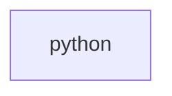

## When to Read
- editing or refactoring `python.ts`

## Overview
- `src/source-extract/python.ts` (55 lines · 2 top-level symbols) — Python symbol and import extraction.

## Graph


## Signatures

```typescript
// ── src/source-extract/python.ts ──
/** Python symbol and import extraction. */
export function extractPythonSymbolLines(py: string): string[] { /* ~21 lines */ }
/** `import x` / `from pkg import` / relative `from ... import` (dependency hints). */
export function extractPythonImports(py: string): string[] { /* ~29 lines */ }

```

## Dependencies
- No dependencies detected
