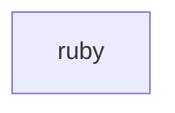

## When to Read
- editing or refactoring `ruby.ts`

## Overview
- `src/source-extract/ruby.ts` (34 lines · 2 top-level symbols) — Ruby symbol and require extraction.

## Graph


## Signatures

```typescript
// ── src/source-extract/ruby.ts ──
/** Ruby symbol and require extraction. */
export function extractRubyImports(rb: string): string[] { const out: string[] = []; for (const rawLine of rb.replace(/\r\n/g, '\n').split('\n')) { const line = rawLine.split('#')[0].trim(); if (!line) continue; const req = line.match(/^…
export function extractRubySymbolLines(rb: string): string[] { /* ~20 lines */ }

```

## Dependencies
- No dependencies detected
