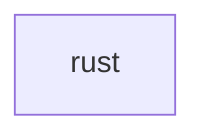

## When to Read
- editing or refactoring `rust.ts`

## Overview
- `src/source-extract/rust.ts` (44 lines · 2 top-level symbols) — Rust symbol and import extraction.

## Graph


## Signatures

```typescript
// ── src/source-extract/rust.ts ──
/** Rust symbol and import extraction. */
export function extractRustImports(rs: string): string[] { /* ~17 lines */ }
export function extractRustSymbolLines(rs: string): string[] { /* ~23 lines */ }

```

## Dependencies
- No dependencies detected
