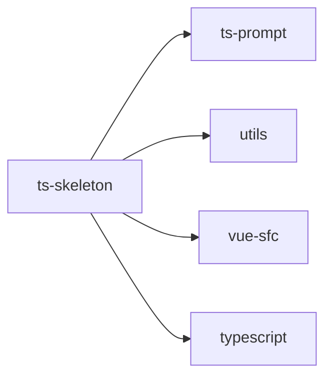

## When to Read
- editing or refactoring `ts-skeleton.ts`

## Overview
- `src/source-extract/ts-skeleton.ts` (236 lines · 1 top-level symbols) — Mirror — `src/source-extract/ts-skeleton.ts`

## Graph


## Signatures

```typescript
// ── src/source-extract/ts-skeleton.ts ──
/**
 * Function / method / composable skeleton from `<script>` or `.ts` (no LLM).
 * Expands `computed(() => { switch ... })` into readable structure.
 */
export function extractScriptSkeleton(script: string, virtualPath: string): string[] { /* prompt template (~178 lines) */ }

```

## Dependencies
**Internal:**
- `src/source-extract/ts-prompt`
- `src/source-extract/utils`
- `src/source-extract/vue-sfc`

**External:**
- `typescript`

## Error Handling
- `createError` (`ts-skeleton.ts`)
