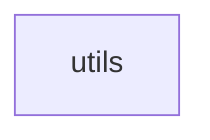

## When to Read
- editing or refactoring `utils.ts`

## Overview
- `src/source-extract/utils.ts` (8 lines · 2 top-level symbols) — Shared limits for deterministic extractors.

## Graph


## Signatures

```typescript
// ── src/source-extract/utils.ts ──
/** Shared limits for deterministic extractors. */
export const SKELETON_MAX_CHARS = 4200;
export function truncateSkeleton(s: string, max = 280): string { const t = s.replace(/\s+/g, ' ').trim(); return t.length > max ? `${t.slice(0, max - 1)}…` : t; }

```

## Dependencies
- No dependencies detected
