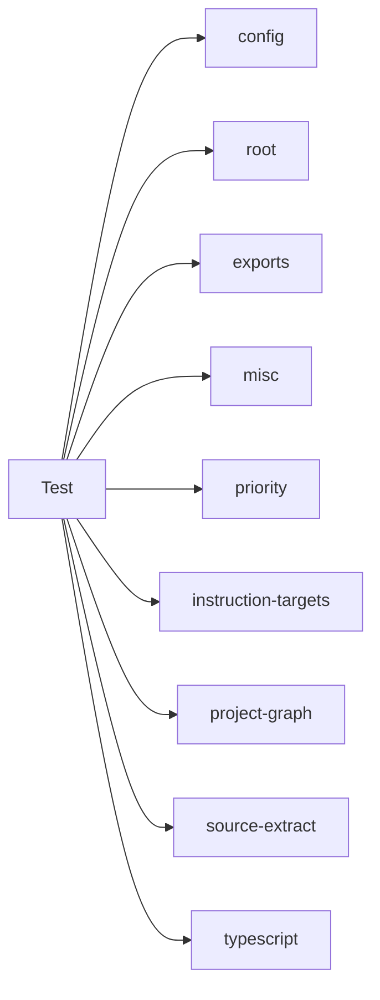

## When to Read
- editing or refactoring `copilotignore.test.mjs`
- editing or refactoring `extract.test.mjs`
- editing or refactoring `instruction-targets.test.mjs`
- editing or refactoring `php-extract.test.mjs`

## Overview
- `test/copilotignore.test.mjs` (38 lines) — Mirror — `test/` (4 files, part 1/2)
- `test/extract.test.mjs` (87 lines · 2 top-level symbols) — Mirror — `test/` (4 files, part 1/2)
- `test/instruction-targets.test.mjs` (158 lines) — Mirror — `test/` (4 files, part 1/2)
- `test/php-extract.test.mjs` (128 lines) — Mirror — `test/` (4 files, part 1/2)

## Graph


## Signatures

```typescript
// ── test/extract.test.mjs ──
/** Targets barrels only — not file purpose. */
export function extractReExportTargets() {}`;
 * Framework-aware deterministic extraction (no LLM).
 */
export function foo() {}`;

// ── test/php-extract.test.mjs ──
// ── skeleton ──
const SAMPLE = `<?php namespace App\\Http\\Controllers\\API; use App\\Enums\\Acl\\Permission; use App\\Http\\Controllers\\Controller; use App\\Repositories\\PlaylistRepository; class FetchInitialData…


// CLI commands:
//   build
```

## Dependencies
**Internal:**
- `dist/config`
- `dist/graph-builder/deterministic/root`
- `dist/graph-builder/extract/exports`
- `dist/graph-builder/extract/misc`
- `dist/graph-builder/plan/priority`
- `dist/instruction-targets`
- `dist/project-graph`
- `dist/source-extract`

**External:**
- `typescript`

## Danger Zone 🔴
- **[fs]** filesystem I/O
