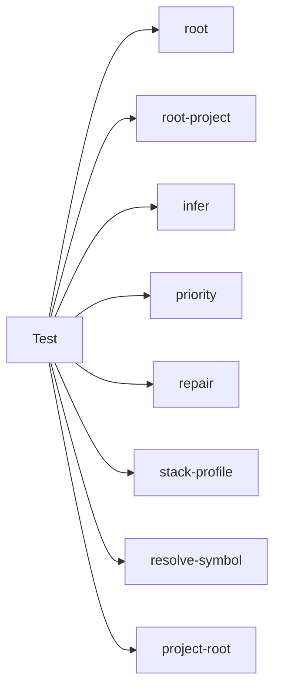

## When to Read
- editing or refactoring `priority.test.mjs`
- editing or refactoring `project-root.test.mjs`
- editing or refactoring `repair-stack.test.mjs`
- editing or refactoring `resolve-symbol.test.mjs`

## Overview
- `test/priority.test.mjs` (60 lines) — Mirror — `test/` (4 files, part 2/3)
- `test/project-root.test.mjs` (44 lines) — Mirror — `test/` (4 files, part 2/3)
- `test/repair-stack.test.mjs` (213 lines · 2 top-level symbols) — Mirror — `test/` (4 files, part 2/3)
- `test/resolve-symbol.test.mjs` (38 lines) — Mirror — `test/` (4 files, part 2/3)

## Graph


## Signatures

```typescript
// ── test/priority.test.mjs ──
// ── skeleton ──
const fileCases = [ /* template ×13 */ ].join('\n');

// ── test/repair-stack.test.mjs ──
// ── skeleton ──
function laravelScan() {
  return { files: paths.map(path => ({ path, tier: path === 'composer.json' || path === 'artisan' ? 1 : 2, c…;
}
function nuxtMonorepoScan() {
  return { files: paths.map(path => ({ path, tier: path.endsWith('package.json') || path.includes('nuxt.conf…;
}

// ── test/resolve-symbol.test.mjs ──
// ── skeleton ──
const plan = { subsystems: [ { file: 'frontend/dev/components/common/_bundle.instructions.md', area: 'Common', priority: 'P1', sourceFiles: ['frontend/dev/components/common/LinkTag.vue'], applyTo: 'f…

```

## Dependencies
**Internal:**
- `dist/graph-builder/deterministic/root`
- `dist/graph-builder/deterministic/root-project`
- `dist/graph-builder/plan/infer`
- `dist/graph-builder/plan/priority`
- `dist/graph-builder/plan/repair`
- `dist/graph-builder/plan/stack-profile`
- `dist/graph-builder/resolve-symbol`
- `dist/project-root`

## Danger Zone 🔴
- **[fs]** filesystem I/O
