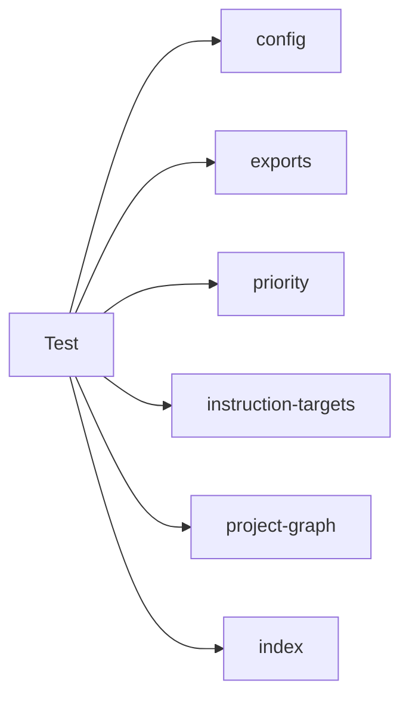

## When to Read
- editing or refactoring `instruction-targets.test.mjs`
- editing or refactoring `java-kotlin-extract.test.mjs`
- editing or refactoring `php-extract.test.mjs`
- editing or refactoring `priority.test.mjs`

## Overview
- `test/instruction-targets.test.mjs` (158 lines) — Mirror — `test/` (4 files, part 2/4)
- `test/java-kotlin-extract.test.mjs` (55 lines) — Mirror — `test/` (4 files, part 2/4)
- `test/php-extract.test.mjs` (128 lines) — Mirror — `test/` (4 files, part 2/4)
- `test/priority.test.mjs` (60 lines) — Mirror — `test/` (4 files, part 2/4)

## Graph


## Signatures

```typescript
// ── test/java-kotlin-extract.test.mjs ──
// ── skeleton ──
const JAVA = `package com.example.api; import org.springframework.web.bind.annotation.GetMapping; import org.springframework.web.bind.annotation.RestController; @RestController public class HelloCont…
const KOTLIN = `package com.example.api import org.springframework.web.bind.annotation.GetMapping import org.springframework.web.bind.annotation.RestController @RestController class HelloController {…

// ── test/php-extract.test.mjs ──
// ── skeleton ──
const SAMPLE = `<?php namespace App\\Http\\Controllers\\API; use App\\Enums\\Acl\\Permission; use App\\Http\\Controllers\\Controller; use App\\Repositories\\PlaylistRepository; class FetchInitialData…

// ── test/priority.test.mjs ──
// ── skeleton ──
const fileCases = [ /* template ×13 */ ].join('\n');

```

## Dependencies
**Internal:**
- `dist/config`
- `dist/graph-builder/extract/exports`
- `dist/graph-builder/plan/priority`
- `dist/instruction-targets`
- `dist/project-graph`
- `dist/source-extract/index`

## Danger Zone 🔴
- **[fs]** filesystem I/O
