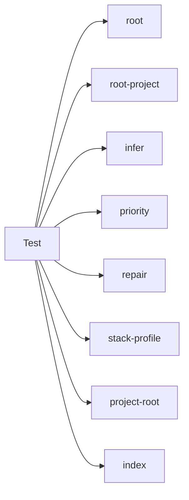

## When to Read
- editing or refactoring `priority.test.mjs`
- editing or refactoring `project-root.test.mjs`
- editing or refactoring `python-extract.test.mjs`
- editing or refactoring `repair-stack.test.mjs`

## Overview
- `test/priority.test.mjs` (60 lines) — Mirror — `test/` (4 files, part 3/5)
- `test/project-root.test.mjs` (44 lines) — Mirror — `test/` (4 files, part 3/5)
- `test/python-extract.test.mjs` (38 lines) — Mirror — `test/` (4 files, part 3/5)
- `test/repair-stack.test.mjs` (213 lines · 2 top-level symbols) — Mirror — `test/` (4 files, part 3/5)

## Graph


## Signatures

```typescript
// ── test/priority.test.mjs ──
// ── skeleton ──
const fileCases = [ /* template ×13 */ ].join('\n');

// ── test/python-extract.test.mjs ──
// ── skeleton ──
const SAMPLE = `from fastapi import APIRouter import os router = APIRouter() @router.get("/items") async def list_items(): pass class ItemService: def run(self): pass `

// ── test/repair-stack.test.mjs ──
// ── skeleton ──
function laravelScan() {
  return { files: paths.map(path => ({ path, tier: path === 'composer.json' || path === 'artisan' ? 1 : 2, c…;
}
function nuxtMonorepoScan() {
  return { files: paths.map(path => ({ path, tier: path.endsWith('package.json') || path.includes('nuxt.conf…;
}

```

## Dependencies
**Internal:**
- `dist/graph-builder/deterministic/root`
- `dist/graph-builder/deterministic/root-project`
- `dist/graph-builder/plan/infer`
- `dist/graph-builder/plan/priority`
- `dist/graph-builder/plan/repair`
- `dist/graph-builder/plan/stack-profile`
- `dist/project-root`
- `dist/source-extract/index`

## Danger Zone 🔴
- **[fs]** filesystem I/O
