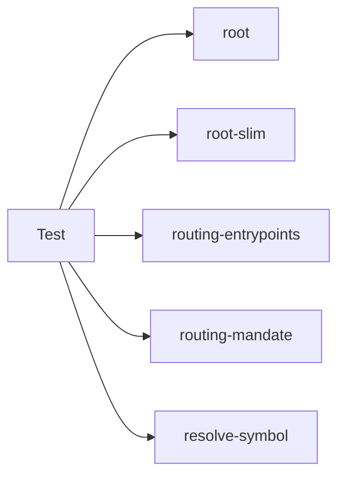

## When to Read
- editing or refactoring `resolve-symbol.test.mjs`
- editing or refactoring `root-slim.test.mjs`
- editing or refactoring `routing-entrypoints.test.mjs`
- editing or refactoring `routing-mandate.test.mjs`

## Overview
- `test/resolve-symbol.test.mjs` (38 lines) — Mirror — `test/` (4 files, part 4/5)
- `test/root-slim.test.mjs` (94 lines · 1 top-level symbols) — Mirror — `test/` (4 files, part 4/5)
- `test/routing-entrypoints.test.mjs` (59 lines) — Mirror — `test/` (4 files, part 4/5)
- `test/routing-mandate.test.mjs` (41 lines) — Mirror — `test/` (4 files, part 4/5)

## Graph


## Signatures

```typescript
// ── test/resolve-symbol.test.mjs ──
// ── skeleton ──
const plan = { subsystems: [ { file: 'frontend/dev/components/common/_bundle.instructions.md', area: 'Common', priority: 'P1', sourceFiles: ['frontend/dev/components/common/LinkTag.vue'], applyTo: 'f…

// ── test/root-slim.test.mjs ──
// ── skeleton ──
function fakePlan(n) {
  return { projectName: 'Big', projectDescription: 'Test app', techStack: ['PHP'], subsystems, };
}

```

## Dependencies
**Internal:**
- `dist/graph-builder/deterministic/root`
- `dist/graph-builder/deterministic/root-slim`
- `dist/graph-builder/deterministic/routing-entrypoints`
- `dist/graph-builder/deterministic/routing-mandate`
- `dist/graph-builder/resolve-symbol`

## Danger Zone 🔴
- **[fs]** filesystem I/O
