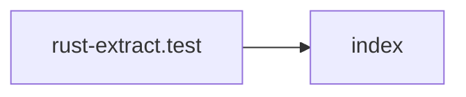

## When to Read
- editing or refactoring `rust-extract.test.mjs`

## Overview
- `test/rust-extract.test.mjs` (44 lines) — Mirror — `test/rust-extract.test.mjs`

## Graph


## Signatures

```typescript
// ── test/rust-extract.test.mjs ──
// ── skeleton ──
const SAMPLE = `use std::io; use axum::{Router, routing::get}; mod handlers; pub struct AppState { db: String, } pub async fn health() -> &'static str { "ok" } #[get("/api")] async fn list_items() ->…

```

## Dependencies
**Internal:**
- `dist/source-extract/index`
