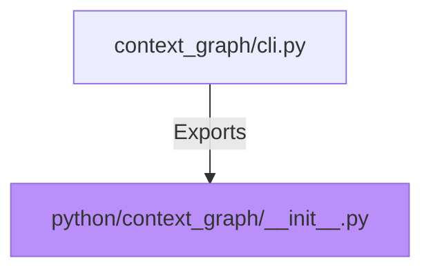

# context-graph (Python wrapper) — Python Context Graph README Documentation

## When to Read
- Viewing Python implementation details and usage instructions

## Graph

## Signatures
### OPENAI_API_KEY (global)
- **Type:** `string`
- **Description:** Environment variable used to set the OpenAI API key.
- **Default:** Not specified; required for context graph functionality.

## Contracts
- Precondition: None explicit
- Postcondition: User has access to the context graph functionality if `OPENAI_API_KEY` is provided.

## Error Handling
- There are no explicit error handling mechanisms as it relies on environment variables and dependencies being set correctly.

## Danger Zone 🔴
- **OPENAI_API_KEY:** Failure will prevent the context graph functionality from running due to missing API key.
- **Node.js & Python Execution Paths:** Incorrect paths could lead to installation or usage errors, depending on system configuration.

